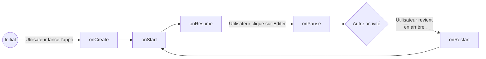
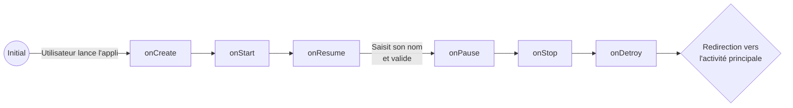
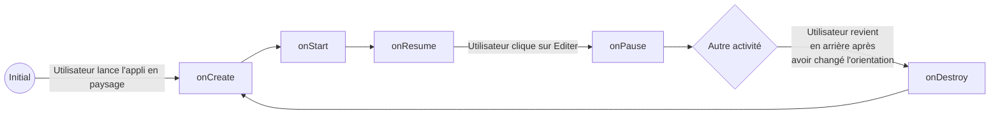
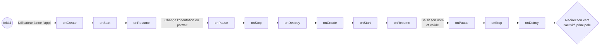

# Rapport Labo 02 DAA
- Flavio Sovilla
- Kevin Ferati
- Malo Romano

## 1. Les Activités
### Que se passe-t-il si l’utilisateur appuie sur « back » lorsqu’il se trouve sur la seconde Activité ? 
La seconde activité est arrêtée et détruite.
La première activité est redémarrée.

### Diagrammes d'état
#### L’utilisateur ouvre l’application, clique sur le bouton éditer, renseigne son prénom et sauve. 
##### _MainActivity_


##### _NameInputActivity_

#### L’utilisateur ouvre l’application en mode portrait, clique sur le bouton éditer, bascule en
mode paysage, renseigne son prénom et sauve. 
##### _MainActivity_


##### _NameInputActivity_


## Que faut-il mettre en place pour que vos Activités supportent la rotation de l’écran ? Est-ce nécessaire de le réaliser pour les deux Activités, quelle est la différence ? 

Lorsque nous basculons l'écran, l'activité va se stopper et se détruire:  
```onPause() - onStop() - onDestroy()```

Puis va se recréer:  
```onCreate() - onStart() - onResume()```

Si rien n'est fait dans la MainActivity, nous perdons alors le nom de l'utilisateur (s'il a été entré au préalable).  
Bien que la même chose ce produit dans notre NameInputActivity, notre texte est gardé si nous l'avons introduit.
Cela est dû à notre modèle de vue qui conserve automatiquement son état et que les données saisies par l'utilisateur 
dans les champs de saisie sont préservées.  
  
Pour éviter ce comportement indésirable dans le MainActivity, nous pourrions utiliser un "ViewModel" qui nous 
permettrait de garder l'état du texte entré préalablement par l'utilisateur. Ainsi, lorsque nous changeront de vue 
le texte restera à l'écran malgré le nouvelle création de l'état.
