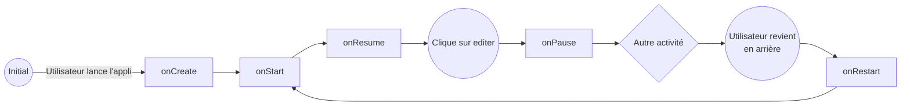

# Rapport Labo 02 DAA
- Flavio Sovilla
- Kevin Ferati
- Malo Romano

## 1. Les Activités
### Que se passe-t-il si l’utilisateur appuie sur « back » lorsqu’il se trouve sur la seconde Activité ? 
La seconde activité est arrêtée et détruite.
La première activité est redémarrée.

### Diagrammes d'état
#### L’utilisateur ouvre l’application, clique sur le bouton éditer, renseigne son prénom et sauve. 
#### MainActivity

