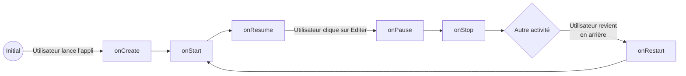
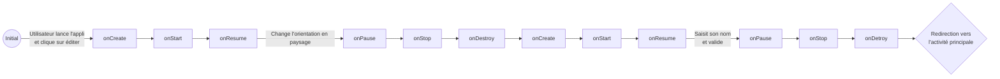

# Rapport Labo 02 DAA
- Flavio Sovilla
- Kevin Ferati
- Malo Romano

## 1. Les Activités
### Que se passe-t-il si l’utilisateur appuie sur « back » lorsqu’il se trouve sur la seconde Activité ? 
La seconde activité est arrêtée et détruite.
La première activité est redémarrée.

### Diagrammes d'état
#### L’utilisateur ouvre l’application, clique sur le bouton éditer, renseigne son prénom et sauve. 
##### _MainActivity_


##### _NameInputActivity_

#### L’utilisateur ouvre l’application en mode portrait, clique sur le bouton éditer, bascule en
mode paysage, renseigne son prénom et sauve. 
##### _MainActivity_


##### _NameInputActivity_


## Que faut-il mettre en place pour que vos Activités supportent la rotation de l’écran ? Est-ce nécessaire de le réaliser pour les deux Activités, quelle est la différence ? 

Lorsque nous basculons l'écran, l'activité va se stopper et se détruire:  
```onPause() - onStop() - onDestroy()```

Puis va se recréer:  
```onCreate() - onStart() - onResume()```

Si rien n'est fait dans la MainActivity, nous perdons alors le nom de l'utilisateur (s'il a été entré au préalable).  
Bien que la même chose se produit dans notre NameInputActivity, notre texte est gardé si nous l'avons introduit.
Cela est dû à notre modèle de vue qui conserve automatiquement son état et que les données saisies par l'utilisateur 
dans les champs de saisie sont préservées.  
  
Pour éviter ce comportement indésirable dans le MainActivity, nous pourrions utiliser un "ViewModel" qui nous 
permettrait de garder l'état du texte entré préalablement par l'utilisateur. Ainsi, lorsque nous changeront de vue le texte restera à l'écran malgré le nouvelle création de l'état. Nous pourrions également sauvegarder l'état manuellement avec onSaveInstanceState.


# 2 - Les fragments

1. La raison pour laquelle la couleur du CouleurFragment est conservée si nous supprimons la fonction `onSaveInstanceState` est que dans la fonction `onProgressChanged`, `color` est attribuée à partir des trois `SeekBar`. Les `SeekBar` possèdent un état interne qui est sauvegardé et réstauré par le système (notamment parce qu'ils ont des ids).
 Au changement de l'orientation, nous pouvons observer que `onProgressChanged` est appelée, ceci après `onViewCreated`. La raison à ça est que la vue est créée, les `views` internes également et ces derniers restaurent leurs états internes, ce qui lance un appel un `onProgressChanged`.

 2. Les deux fragments étant indépendants, il se passe la même chose que s'il y a avait eu un seul `ColorFragment`. Les transitions d'état opérées après une rotation sont les suivantes : 

 ``` 
 onSaveInstanceState -> onDestroyView -> onDestroy -> onCreate -> onViewCreated
  ```

  L'état est d'abord sauvegardé, le fragment est détruit, puis lui et sa vue sont recréées. C'est à ce moment là que le texte est initialisé.

# 3 - FragmentManager

Nous avons implémenté cette étape de la manière suivante : 
1. Une classe `MainActivityFragments2`qui est l'activité contenant les boutons et le fragment à afficher, ainsi qu'une vue `activity_main_fragments` qui y est associée ;
2. Une classe `IdentifiableFragment` qui est le fragment représentant une étape, ainsi qu'une vue `fragment_identifiable` qui y est associée.

Le fragment a un état interne ainsi qu'une fonction `newInstance` permettant de spécifier une étape et qui va retourner un nouveau `IdentifiableFragment`. Cette étape est considérée comme étant un état interne et est maintenue au travers d'un `Bundle`. C'est comme ça que nous avons pu sauvegarder l'état en cas de changement de configuration.

L'activité est assez simple. Les boutons de fermeture et de retour appellent `finish()` (ce dernier s'il n'y a plus rien dans la pile après suppression du dernier fragment). Pour que la première étape s'affiche automatiquement, il y avait deux solutions : soit spécifier avec `android:name` le nom du fragment à afficher, soit le faire avec du code en l'ajoutant manuellement, par exemple dans `onViewCreated`. Nous avons choisi cette dernière solution car nous avions des problèmes dans le premier cas, notamment que le fragment ne semblait pas être dans le `backStack`.

`add` ajoute la vue du fragment par dessus de celles actuellement dans le `FragmentContainerView`, `replace` la remplace.

